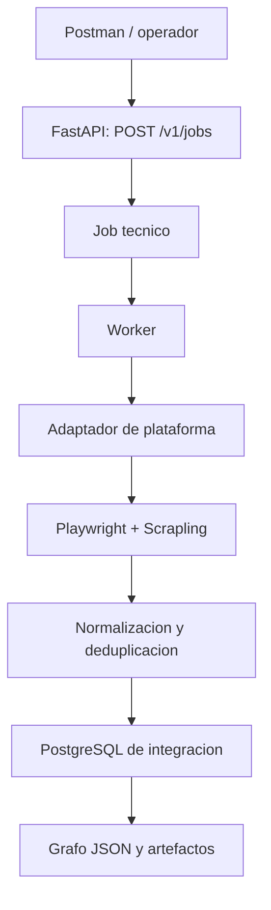
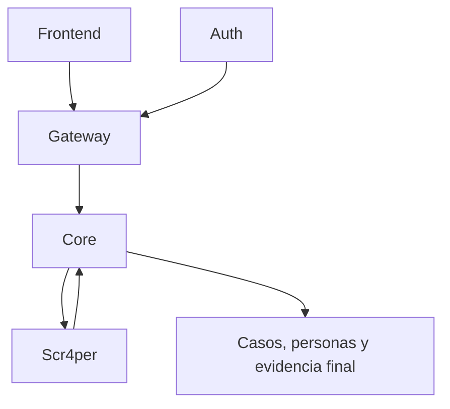

# Scr4per MVP: Arquitectura Propuesta

## 1. Objetivo

Construir y validar un microservicio de adquisicion OSINT social llamado **Scr4per**, aislado de Core, Auth y Gateway durante el MVP.

El MVP debe poder:

- Recibir un objetivo social y limites de extraccion.
- Ejecutar scraping con Playwright y Scrapling.
- Normalizar, deduplicar y persistir evidencia social.
- Crear un grafo tecnico a partir de la evidencia guardada.
- Exponer estado, errores y artefactos del trabajo.

El objetivo no es hacer un prototipo desechable. La estructura debe permitir integrar Core posteriormente sin reescribir el motor de scraping.

## 2. Principio de responsabilidad

> Scr4per adquiere y estructura evidencia tecnica. No administra casos, personas fisicas, usuarios, permisos ni decisiones de negocio.

| Componente | Responsabilidad | No debe hacer |
|---|---|---|
| Scr4per | Extraer, normalizar, deduplicar, persistir evidencia social y generar grafos tecnicos. | Crear casos, personas fisicas, usuarios, roles o permisos. |
| Core | Autorizar acciones sobre casos, personas e identidades; vincular evidencia con el dominio investigativo. | Ejecutar scraping o administrar sesiones de redes sociales. |
| Auth | Emitir identidad autenticada y roles/claims. | Resolver si un usuario puede operar un caso concreto. |
| Gateway | Autenticar, enrutar y aplicar politicas transversales. | Ejecutar logica de negocio o persistir evidencia. |

## 3. Alcance del MVP

### Incluye

- API FastAPI asincrona para trabajos tecnicos.
- Playwright para navegacion, storage state, contextos aislados, scroll, modales e interceptacion de respuestas GraphQL.
- Scrapling como parser de HTML complementario y fallback.
- Adaptador inicial de Facebook a partir de `facebook_analyzer.py`.
- Base para adaptadores de Instagram y X unicamente carpetas vacias.
- Persistencia en una copia limpia de PostgreSQL con el esquema actual que se encuentra en migrations.
- Creacion de identidades digitales y evidencia social en `personas` y `redes`.
- Construccion manual y consulta del grafo tecnico.
- Logs estructurados, errores clasificados, artefactos y tool runs.

### No incluye todavia

- JWT, Auth, roles, permisos o Gateway.
- Creacion, actualizacion o vinculacion de casos.
- Creacion de personas fisicas.
- Acceso a `casos`, `entidades` o `sabanas`.
- Exposicion directa a Internet.
- RLS basado en usuario, organizacion o caso.

## 4. Flujo del MVP



Flujo detallado:

1. Se envia un objetivo, alcance y limites a `POST /v1/jobs`.
2. FastAPI valida el payload y crea un `job_id` propio de Scr4per.
3. Un worker toma el trabajo y prepara Playwright.
4. El adaptador de plataforma extrae perfil, listas, publicaciones e interacciones.
5. El normalizador transforma la salida especifica de plataforma a modelos internos.
6. El repositorio persiste identidades y evidencia mediante upserts.
7. Se genera un grafo tecnico y un manifiesto de artefactos.
8. El cliente consulta estado, grafo, artefactos y tool runs.

## 5. API del MVP

Durante el MVP los endpoints no requieren Auth, pero Scr4per debe quedar disponible solo por `localhost`, VPN o red interna de Docker. La falta de autenticacion no elimina validacion de payload, plataformas permitidas ni limites tecnicos.

| Metodo | Ruta | Uso |
|---|---|---|
| `GET` | `/health/live` | Verifica que el proceso esta activo. |
| `GET` | `/health/ready` | Verifica DB, migraciones y dependencias. |
| `POST` | `/v1/jobs` | Crea un trabajo tecnico y responde `202 Accepted`. |
| `GET` | `/v1/jobs/{job_id}` | Consulta estado, progreso, resumen y errores. |
| `POST` | `/v1/jobs/{job_id}/cancel` | Solicita cancelacion cooperativa. |
| `POST` | `/v1/jobs/{job_id}/graph/build` | Construye o reconstruye el grafo desde evidencia persistida. |
| `GET` | `/v1/jobs/{job_id}/graph` | Obtiene el grafo JSON. |
| `GET` | `/v1/jobs/{job_id}/tool-runs` | Expone ejecuciones tecnicas y errores por herramienta. |
| `GET` | `/v1/jobs/{job_id}/artifacts` | Lista JSON, CSV, capturas y otros archivos generados. |

### Crear un job

```json
POST /v1/jobs

{
  "target": {
    "platform": "facebook",
    "url_or_username": "juan.perez"
  },
  "scope": {
    "profile": true,
    "friends": true,
    "followers": true,
    "following": true,
    "photos": true,
    "comments": true,
    "reactions": true
  },
  "limits": {
    "max_friends": 100,
    "max_followers": 100,
    "max_following": 100,
    "max_photos": 10,
    "max_comments_per_post": 25
  }
}
```

Respuesta:

```json
{
  "job_id": "scr_01JZ7Q8V...",
  "status": "queued",
  "created_at": "2026-06-24T12:00:00Z"
}
```

### Regla de contrato

El MVP no recibe `id_usuario`, `id_caso` ni `id_persona`.

Al integrar Core, se podra agregar una referencia de correlacion no propietaria:

```json
{
  "correlation": {
    "core_analysis_id": 3
  }
}
```

Scr4per seguira usando `job_id` como identificador de cada ejecucion. `core_analysis_id` solo enlaza el trabajo tecnico con un registro que pertenece a Core.

## 6. Estados de ejecucion

| Estado | Significado | Siguiente estado esperado |
|---|---|---|
| `queued` | Trabajo creado y pendiente de worker. | `running` o `cancelled` |
| `running` | El adaptador y navegador estan adquiriendo datos. | `persisting`, `failed` o `cancelled` |
| `persisting` | Se guardan datos normalizados. | `graph_building` o `failed` |
| `graph_building` | Se genera grafo y manifiesto. | `completed` o `failed` |
| `completed` | Job y artefactos disponibles. | Reconstruccion manual opcional. |
| `failed` | Error terminal controlado y trazable. | Nuevo intento. |
| `cancelled` | Cancelacion cooperativa. | Sin transacciones incompletas. |

Cada intento debe registrar: inicio, fin, plataforma, adaptador, limites, conteos, error clasificado, artefactos y referencias de evidencia.

## 7. Estructura propuesta

```text
scr4per/
  app/
    main.py                         # Fabrica FastAPI, middleware y routers

    api/
      routers/
        health.py
        jobs.py
        graphs.py
        artifacts.py
      schemas/
        jobs.py                     # Pydantic requests/responses
        graphs.py

    application/
      commands/
        create_job.py
        cancel_job.py
        build_graph.py
      services/
        job_service.py
        analysis_service.py
        graph_service.py
      ports/
        job_repository.py
        evidence_repository.py
        artifact_storage.py
        job_queue.py
        browser_factory.py

    domain/
      models/
        job.py
        target.py
        profile.py
        post.py
        comment.py
        reaction.py
        social_edge.py
        artifact.py
      enums/
        platform.py
        job_status.py
        edge_type.py
      policies/
        limits.py
        deduplication.py

    scrapers/
      base.py                        # Contrato PlatformAdapter
      shared/
        browser_context.py
        graphql_capture.py
        url_normalizer.py
        selectors.py
      facebook/
        adapter.py
        profile.py
        lists.py
        photos.py
        graphql.py
      instagram/
        adapter.py
        profile.py
        lists.py
        posts.py
        graphql.py
      x/
        adapter.py
        profile.py
        lists.py
        replies.py

    infrastructure/
      db/
        sqlalchemy_models.py
        repositories.py
        migrations/
      browser/
        playwright_factory.py
        session_store.py
      storage/
        artifact_storage.py
      queue/
        local_worker_queue.py
      observability/
        logging.py
        metrics.py

    workers/
      job_worker.py

    tests/
      unit/
      integration/
      contract/

  alembic/
  pyproject.toml
  Dockerfile
  docker-compose.yml
```

### Regla de dependencia

- `api` solo conoce `application`.
- `application` conoce `domain` y sus `ports`.
- `scrapers` entrega modelos normalizados de `domain`.
- `infrastructure` implementa los `ports`.
- El motor de scraping no conoce FastAPI, SQLAlchemy ni detalles de tablas.

## 8. Papel de cada tecnologia

| Tecnologia | Responsabilidad |
|---|---|
| FastAPI | Contratos HTTP, Pydantic, respuestas `202`, consulta de estados y observabilidad. |
| Playwright | Navegacion real, contextos aislados, storage state, scroll, modales, interceptacion GraphQL y capturas. |
| Scrapling | Parsing complementario de HTML para nombres, enlaces, fotos y fallbacks cuando los datos de red no son suficientes. |
| PostgreSQL | Persistencia de integracion, evidencia social, estados y trazabilidad. |

Prioridad de extraccion:

1. Respuestas estructuradas de red o GraphQL.
2. Selectores y evaluaciones de Playwright.
3. Scrapling como parser tolerante de HTML.

## 9. Persistencia en la base de integracion

Se puede usar una copia en blanco del esquema actual para validar el flujo completo. Esto es valido para el MVP, siempre que Scr4per use un usuario de BD limitado y no se conecte como `postgres`.

| Schema | Uso por Scr4per MVP | Acceso |
|---|---|---|
| `redes` | Analisis, publicaciones, comentarios, reacciones, multimedia, vinculos y catalogos. | Lectura/escritura limitada. |
| `personas` | Crear o actualizar `identidad_digital`; no crear personas fisicas. | Lectura/escritura limitada. |
| `casos` | No participa en el MVP. | Sin acceso. |
| `entidades` | No participa en el MVP. | Sin acceso. |
| `sabanas` | No participa en el MVP. | Sin acceso. |

Catalogos iniciales requeridos:

- `redes.plataforma`: `FACEBOOK`, `INSTAGRAM`, `X`.
- `redes.tipo_vinculo_social`: `FRIEND`, `FOLLOWER`, `FOLLOWING`, `COMMENTED`, `REACTED` y los que se implementen.

El usuario `scraper_mvp` debe tener:

- `USAGE` en `personas` y `redes`.
- `SELECT`, `INSERT`, `UPDATE` y, solo si es necesario, `DELETE` sobre tablas permitidas.
- Permisos sobre secuencias usadas por inserts.
- Ningun `GRANT` sobre `casos`, `entidades` o `sabanas`.

## 10. RLS

No se recomienda agregar RLS como requisito del MVP aislado.

Todavia no existe un contexto confiable de usuario, organizacion o caso. Crear politicas RLS antes de definir ese contexto produce complejidad sin proteccion real.

La proteccion del MVP debe ser:

1. Base de integracion separada.
2. Usuario `scraper_mvp` no privilegiado.
3. Permisos `GRANT` limitados a `personas` y `redes`.
4. Servicio disponible solo dentro de la red interna.

RLS se evaluara despues de integrar Core/Auth, cuando exista una politica clara por organizacion, usuario y caso.

> RLS no protege si un microservicio usa `postgres`, un superusuario o el propietario de las tablas. Eliminar credenciales privilegiadas es requisito previo.

## 11. Grafo tecnico y artefactos

Se conserva `POST /v1/jobs/{job_id}/graph/build` en el MVP porque permite revisar y reconstruir el resultado del scraper sin volver a ejecutar navegacion.

| Elemento | Contenido minimo |
|---|---|
| Nodo | Identidad digital: plataforma, username, URL, nombre publico, foto y referencia interna. |
| Arista | Origen, destino, tipo, job de origen, fecha de observacion y evidencia. |
| Manifiesto | Conteos, version, limites usados, fecha, job_id, errores parciales y hash. |
| Artefactos | Grafo JSON, CSV de inspeccion, datos normalizados, capturas opcionales y logs. |

El grafo debe poder construirse desde evidencia persistida, sin necesitar un nuevo scraping.

## 12. Integracion futura con Core, Auth y Gateway



Flujo futuro:

1. Frontend envia solicitud autenticada a Gateway.
2. Gateway valida la identidad emitida por Auth y enruta hacia Core.
3. Core valida permisos sobre caso, persona o identidad digital.
4. Core crea el analisis de negocio y solicita un job tecnico a Scr4per usando credenciales de servicio.
5. Scr4per ejecuta el mismo contrato de jobs del MVP.
6. Scr4per reporta estado, resultado o evento de finalizacion.
7. Core consolida evidencia y la vincula con casos, personas e identidades segun la autorizacion.

La integracion debe agregar autenticacion entre servicios y una correlacion como `core_analysis_id`, sin convertir a Scr4per en propietario de casos o personas.

## 13. Plan de implementacion

| Fase | Entregable | Criterio de aceptacion |
|---|---|---|
| 1. Base | FastAPI, configuracion, health, logging y migraciones. | Inicia en Docker y readiness valida base. |
| 2. Jobs | Crear, consultar y cancelar jobs; worker local. | `queued -> running -> completed/failed`. |
| 3. Facebook | Adaptador extraido del script standalone. | Perfil, listas e interacciones con limites y errores controlados. |
| 4. Persistencia | Upserts e idempotencia en `personas` y `redes`. | Reintentos no duplican identidades ni vinculos. |
| 5. Grafo | Construccion, consulta y manifiesto. | Grafo reconstruible sin scraping nuevo. |
| 6. Pruebas | Unitarias, integracion y contrato HTTP. | Payload invalido, cuenta expirada y perfil restringido se controlan. |
| 7. Core | Adaptador HTTP/eventos entre servicios. | Core inicia y consulta jobs sin acceder a internals. |

## 14. Criterios de cierre del MVP

- Se puede crear un job de Facebook desde Postman y consultar su avance.
- Sesion invalida, perfil restringido, limites y errores de plataforma no dejan datos inconsistentes.
- Se generan identidades digitales y evidencia deduplicada en la base de integracion.
- Se puede generar y consultar un grafo JSON para un job completado.
- Scr4per no tiene permisos sobre `casos`, `entidades` ni `sabanas`.
- El motor de scraping se puede probar sin FastAPI.
- Los casos de aplicacion se pueden probar sin un navegador real.
- La futura conexion con Core requiere un adaptador de comunicacion, no una reescritura del motor ni de los adaptadores de plataforma.

## Resultado esperado

Un microservicio de adquisicion OSINT social validado de extremo a extremo, con responsabilidades claras, evidencia trazable y una ruta limpia para incorporarse posteriormente al ecosistema NAAT.
